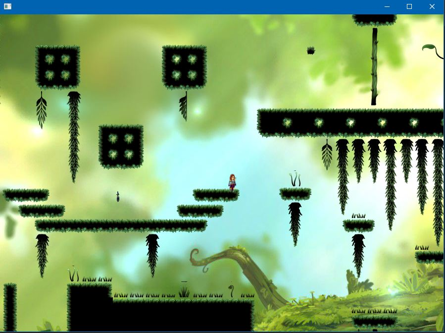
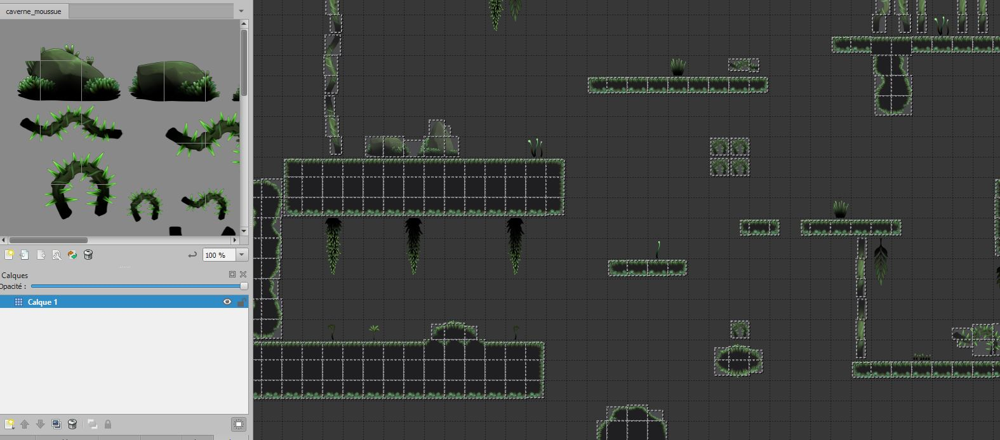
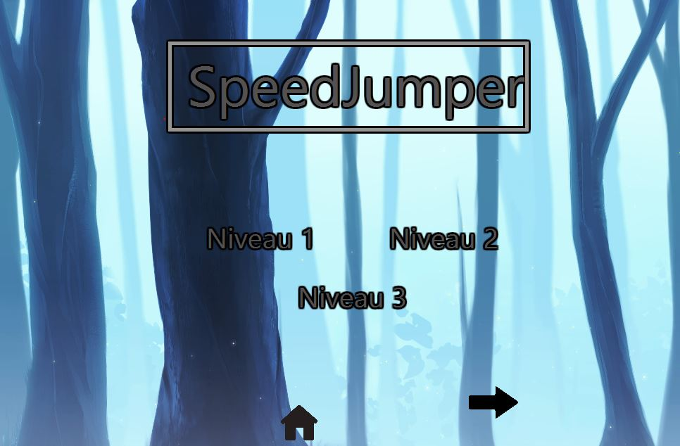

# Speed Jumper
## Description générale
Speed Jumper est un jeu de plateforme sur PC. La guerrière représente le joueur et peut se déplacer sur l'écran à sa guise, sauter, tomber et mourrir. Il est ainsi possible d'explorer de vates niveaux colorés tout en profitant du système de scrolling mit en place.  
Jeu réalisé dans le cadre de la deuxième année de DUT informatique.

  
*Capture d'écran de la fenêtre de jeu principale*

## Détails
Basé sur un système de *tile-mapping*, chaque carte est créée à la main depuis le logiciel Tiled et est complètement personnalisée.

  
*Capture d'écran du logiciel Tiled et édition de la première carte du jeu*  

De cette manière, vous avez la possibilité de contribuer et d'ajouter vos propres cartes, le tout **sans avoir à modifier du code existant**. En effet, nous avons créé un moteur de jeu complet, avec une caméra qui saura s'adater à toutes les cartes. Vous pouvez de la même manière créer vos propres collisions depuis le logiciel Tiled et les intégrer au jeu sans avoir à modifier du code !  

Vous pouvez également modifier vos touches pour qu'elles s'adaptent à n'importe quel type de clavier simplement depuis un fichier texte.  

Enfin, il est bon de noter que des menus responsives ont été réalisés pour organiser notre jeu, le rendre plus accessible et le structurer.

  
*Capture d'écran du menu principal de notre jeu*

----------------  
Vous l'aurez comrpis, Speed Jumper est un jeu extrêmement permitif et ouvert, de telle sorte qu'il est possible d'intégrer ses propres éléments à l'intérieur relativement facilement. Des menus ont été réalisés pour des transitions fluides entre les différentes fenêtres. Le Modèle et la structuration logique du jeu est reprenable en l'état et peut facilement être intégré dans un autre toolkit graphique sans modification préalable.  

> ⚠️ ATTENTION : il se peut qu'un bug se produise (ce n'est pas tout le temps le cas) quand le personnage tombe dans le vide et meurt, le jeu peut se *softlock*. Si cela arrive, il faut le relancer. Nous allons le corriger à l'avenir.

## Eléments importants dans le programme
* Moteur de jeu créé de A à Z.
* Création des entités, collisions et caméra avec système de *scrolling* (=défilement) horizontal et vertical.
* Système de mort en cas de chute dans le vide, système de pause, tableau des scores avec des cellules.
* Boucle de jeu threadée observable.
* Programmation orientée objet et séparation du modèle et de la vue dans plus de 100 classes différentes.
* Respect des principes SOLID et attribution d'une reponsabilité par classe.
* Gros travail de conception (patrons de conception...), architecture soignée, organisée.
* Programme documenté, structuré, découpé en paquetages.
* Contenu facilement intégrable et modifiable depuis des fichiers texte car un gros travail d'extensibilité à été mis en place.
* Vous pouvez configurer vos touches, ajouter vos cartes et collisions.
* Bien sûr, des niveaux et du contenu sont déjà présents dans le jeu par défaut.
* Menu, fenêtres responsives et *design*.
* Voir la documentation détaillée en cas de question (diagrammes, sketchs...).

## Technologies utilisées
* Java
* La bibliothèque graphique **JavaFX**

## Comment le lancer ?
1. Depuis IntelliJ IDEA, ouvrir le projet. Penser à télécharger JavaFX au préalable et le configurer depuis la fenêtre `Project Structure`.
2. En cas de problème de mise en place, se référer au site officiel et à sa documentation concernant la configuration ([documentation officielle](https://openjfx.io/openjfx-docs/)).
3. Lancer le projet, il va se compiler et s'éxécuter. Vous pouvez alors jouer ! 😄

## Auteurs
Jérémy TREMBLAY  
Antoine PELLEGRINO
